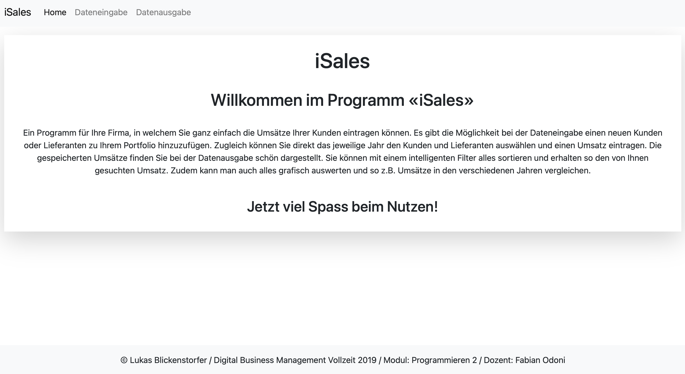
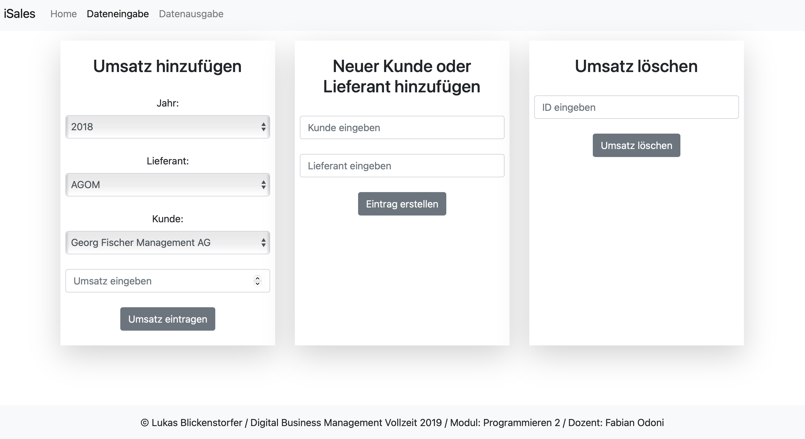
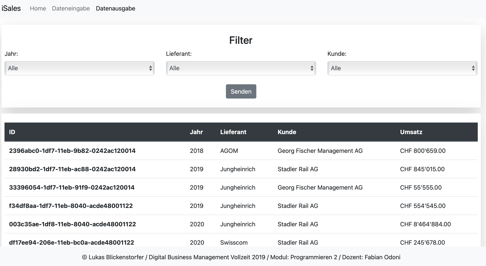
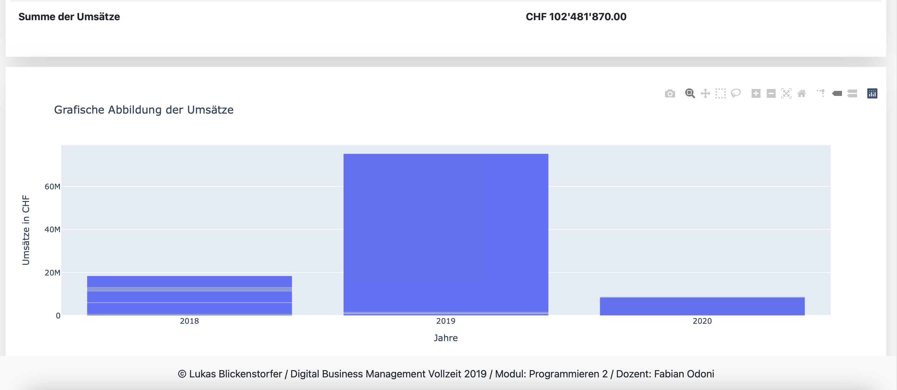

# iSales

## Ausgangslage
Eine Firma XY erhält jährlich Umsatzzahlen Ihrer verschiedenen Kunden, welche bei den Lieferanten, mit welche die Firma XY Verträge hat, getätigt werden. Die Umsätze wurden in einer Excel Liste nachgeführt und mussten umständlich eingebetet und sortiert werden.

## Funktion iSales
Das Webapp iSales soll Abhilfe schaffen und kann genutzt werden um Ihre Kunden und Lieferanten einzutragen und zu pflegen. Der Hauptsinn besteht darin die Umsätze der verschiedenen Jahre einfach einzutragen und wenn nötig einfach zu löschen, jedoch mit einer gewissen Sicherheit. Ein weitere Vorteil ist der Filter mit welchen man gezielt nach einem Umsatz suchen kann. Zusätzlich erhält man eine grafische Abbildung der Umsätze im jeweiligen Jahr.

## Installation
1. Zuerst müssen Sie das [Github Repository iSales](https://github.com/lublic/iSales_1) als Zip-Datei downloaden
2. Download Zip-Datei entpacken
3. Programm wie z.B. Pycharm öffnen und die Datei iSales öffnen
4. Bei Pycharm müssen Sie eine Neue Konfiguration erstellen und **main.py** auswählen
5. Nun können sie die Playtaste drücken und es wird ein Link z.B. http://127.0.0.1:5000 erscheinen
6. Auf diese http Adresse klicken und das Programm wird im Explorer geöffnet
7. Bereit zur Nutzung

Folgende Pakete müssen noch installiert werden:

- flask
star:
    - Flask
    - flash
    - render_template
    - request

- plotly.express as px
- plotly

- json

- uuid

## Github
Da es fehler im ersten Repository gab wurde ein zweites erstellt mit dem Namen iSales_1. Das alte Repository ist folgendes [Github Repository iSales](https://github.com/lublic/iSales).

## Workflow
### Dateneingabe
Man kann neue Kunden, Lieferanten und Umsätze eintragen. Zudem kann man Umsatz-Einträge löschen.

### Datenverarbeitung/Speicherung
Die Einträgen werden in den folgenden Files eingetragen oder daraus gelöscht im JSON Format.

**jahre.json**
Liste der Jahre

**kunden.json**
Liste alles Kunden

**lieferanten.json**
Liste mit allen Lieferanten

**umsatz.json**
Liste mit den Umsätzen

### Datenausgabe
Beim abrufen der Daten werden die benötigten Einträge herausgezogen und im Frontend mittels Jinja2 ausgegeben.

## Benutzeranleitung

Auf der Home Seite kann man eine kurze Einführung über das Webapp lesen.

Bei der Dateneingabe kann man alle Kunden, Lieferanten und Umsätze pflegen und neue hinzufügen.

Im ersten Feld kann man einen neuen Umsatz hinzufügen. Man muss das jeweilige Jahr, Lieferant und Kunde mit dem Dropdown auswählen. Zusätzlich noch den Umsatz eingeben und danach auf **Umsatz eintragen** drücken.

Im zweiten Feld kann man einen neuen Kunden oder Lieferanten hinzufügen. Neuer Kunde oder Lieferant eingeben und auf **Eintrag erstellen** drücken. Gibt es den Kunden oder Lieferanten bereits, wird es eine Meldung geben. 

Im dritten Feld kann man einen Umsatz löschen. Man muss bei der Datenausgabe die ID kopieren und in das Feld "ID eingeben" einfügen. Danach **Umsatz löschen** drücken. Gibt es den Umsatz mit der jeweiligen ID nicht, wird es eine Meldung geben.

Bei der Datenausgabe können Sie alles gespeicherten Umsätze auffinden und betrachten.

Beim Filter können Sie nach dem Jahr, Lieferanten oder Kunden suchen. Mi dem Dropdown können Sie die jeweiligen gewünschten Werte auswählen. Um das Filtern zu starten müssen Sie immer **Senden** drücken.

Die Umsätze sind immer auf einer Spalte und besitzen die Werte ID/Jahr/Lieferant/Kunde/Umsatz. Unter dem letzten Eintrag finden sie jeweils die Summer der gesamten oder gefilterten Umsätze.

Zusätzlich können Sie unter der Umsatzliste die grafische Darstellung der Umsatzzahlen finden. Diese passt sich automatisch an die gefilterten Umsätze an.

